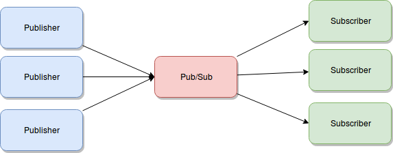

redis消息订阅有三种方式

- Pub/Sub
- Blocking lists
- Steams


### Pub/Sub



- 一对多
- 同样的消息发给多个订阅者，Subcriber决定要不要
- 可能会丢

使用场景
- 聊天服务器
- 系统通知
- 日志集中化


### Blocking lists

结构和普通的list一样。
发布者用LPUSH或RPUSH，订阅者用BLPOP或BRPOP拿，B means blocking。

- Publisher普通得PUSH数据进去
- Subcriber不订阅，他们做操作是 blocking POP。直到publisher push数据之前，一直在等待

Q：多订阅者怎么办？
A: 只能发布给一个订阅者，这个订阅者去决定拿到数据怎么办。

### Streams
append only log structure

<!--more-->

#### XADD
publish data

```
XADD yourstreamname * key1 value1 key2 value2
```
`*` 表示让redis自动生成一个id。
获得数据如下，在一个叫做`yourstreamname`的stream里

```
{
"key1":"value1",
"key2":"value2"
}
```
自动生成的id：`<millisecondsTime>-<sequenceNumber>`

限制stream的长度

```
XADD mystream MAXLEN 2 * value 1

XADD mystream MAXLEN ~ 1000 * ... entry fields
```
~ 表示approximately，因为trim长度可能会费资源，如果不是很介意长度一定要1000，可以用`~ 1000`表示，至少有1000。


#### XLEN
```
> XLEN mystream
(integer) 1
```

subcriber

#### XREAD

```
XREAD COUNT 2 STREAMS yourstreamname 0
// or
XREAD BLOCK 0 STREAMS yourstreamname 0
```

这里的`0`是指需要id大于“0-0”。比如可以带着上一次的id请求，即可获得之后的数据。

- `BLOCK`这里和“blocking list”一样，堵塞直到有新的message才返回。
- 每个subcriber都能接收到信息，和“Pub/Sub”一样
- 但发送过的信息会留着，这里和“Pub/Sub"不一样。可通过 `XRANGE` 或 `XREVRANGE` with streamID 取消息

#### XRANGE
```
XRANGE yourstreamname 13213131-0 + COUNT 3
```
`-`和`+` 分别代表最小和最大的ID，比如

```
XRANGE mystream - +

XRANGE mystream - + COUNT 2
```

**Consumer Groups** 消费者组
允许一组的subcriber协同处理同一个stream里的数据。

组里的不同consumer收到不同的消息，

不同subcriber从一个stream获取数据，但是不同的速度。用group可以只会发给群里的一个人。
consumers要发ACK给redis。

```
XGROUP CREATE yourstreamname yourgroup $

XREADGROUP GROUP historicgroup consumer1 BLOCK 0 STREAMS yourstream

XACK yourstream historicgroup 1231241142-0
```
`$`表示stream里当前最大的ID，用`$`表示只想要最新的消息。

```
XGROUP CREATE mystream consumer-group-name $ MKSTREAM
```

`MKSTREAM` 表示如果stream `mystream`不存在的话，自动创建这个stream。

这个stream可以同时用XREAD、XREADGROUP用，甚至不同的group。


### Ref:
* [Introduction to Redis Streams](https://redis.io/topics/streams-intro)
* [Why are we getting Streams in Redis?](https://blog.logrocket.com/why-are-we-getting-streams-in-redis-8c36498aaac5)


